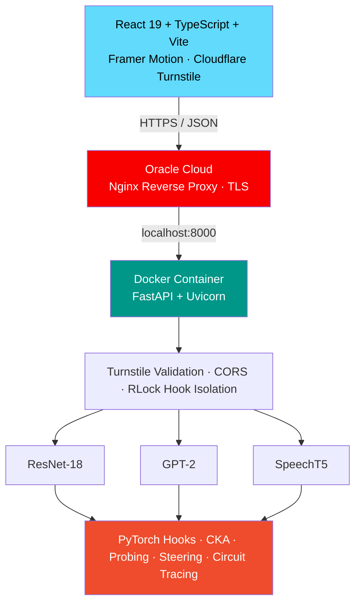

<div align="center">

# 🧠 BrainBox

### Interactive Neural Network Experimentation Laboratory

**Most AI tools let you *use* models. BrainBox lets you *understand* them.**

Disable a layer. Steer an activation. Trace a circuit. Watch the model change in real time — not in theory, in your browser.

[](https://brainbox-neura.vercel.app)
[](https://brainbox-neura.duckdns.org)
[](LICENSE)

[](#-local-development)
[](#️-models--tooling)
[](#️-models--tooling)
[](#️-models--tooling)
[](#️-system-architecture)
[](#️-deployment-guide)

</div>

<br>

<p align="center">
  
</p>

<br>

## 📚 Table of Contents

- [Why BrainBox](#-why-brainbox)
- [Interactive Labs](#-interactive-labs)
- [System Architecture](#️-system-architecture)
- [Models & Tooling](#️-models--tooling)
- [Security & Production Hardening](#-security--production-hardening)
- [API Reference](#-api-reference)
- [Local Development](#-local-development)
- [Deployment Guide](#️-deployment-guide)
- [Reliability Notes](#️-reliability-notes)
- [Project Structure](#-project-structure)
- [License](#-license)

<br>

## 🎯 Why BrainBox

Most people's first encounter with a neural network is through a text box: type a prompt, get an output, repeat. Everything in between stays a black box — you never see a layer switch off, a representation collapse, or an attention head decide what a sentence is about.

**BrainBox removes the black box.** Ablate a ResNet block and see which class predictions collapse. Steer a GPT-2 activation along a concept vector and watch the generated text bend toward it. Trace which of 144 attention heads a circuit actually routes through.

It deliberately runs on small, well-understood models — **ResNet-18**, **GPT-2 (124M)**, and **SpeechT5** — instead of frontier-scale ones, so every experiment stays interpretable, reproducible, and cheap enough to run on plain CPU hardware.

<br>

## 🧪 Interactive Labs

<table>
<tr>
<td width="60" align="center">👁️</td>
<td width="180"><b>Vision Lab</b></td>
<td>Mechanistic layer ablation on ResNet-18 with activation inspection and feature visualization.</td>
</tr>
<tr>
<td align="center">🗣️</td>
<td><b>Language Lab</b></td>
<td>GPT-2 transformer-block ablation with live output/logit behavior tracking.</td>
</tr>
<tr>
<td align="center">🎧</td>
<td><b>Audio & Speech Lab</b></td>
<td>SpeechT5 six-layer decoder intervention, CMU Arctic speaker embeddings, phonetic degradation, 16 kHz WAV output.</td>
</tr>
<tr>
<td align="center">🔎</td>
<td><b>Auto-Circuit Discovery</b></td>
<td>Causal tracing across up to 144 GPT-2 attention heads with Top-10 critical-node ranking.</td>
</tr>
<tr>
<td align="center">📊</td>
<td><b>Similarity & Probing</b></td>
<td>Linear CKA and linear probing for representation analysis.</td>
</tr>
<tr>
<td align="center">🛡️</td>
<td><b>Safety & Steering</b></td>
<td>Representation engineering via activation steering vectors.</td>
</tr>
<tr>
<td align="center">🤖</td>
<td><b>Guided AI Co-Pilot</b></td>
<td>Context-aware help for architecture and experiment concepts.</td>
</tr>
<tr>
<td align="center">🔗</td>
<td><b>State Capture</b></td>
<td>Reproducible experiment snapshots and shareable URLs.</td>
</tr>
</table>

<br>

## 🏗️ System Architecture



| Layer | Location |
|---|---|
| REST API | [`backend/main.py`](backend/main.py) |
| Interpretability core | [`src/neural_archaeology/`](src/neural_archaeology/) |
| UI / Labs | [`frontend/`](frontend/) |

<br>

## ⚙️ Models & Tooling

| Layer | Technologies | Purpose |
|---|---|---|
| **Frontend** | React 19, TypeScript, Vite, Framer Motion | Interactive laboratory UI |
| **Backend** | FastAPI, Uvicorn | REST experiment API |
| **Deep Learning** | PyTorch, TorchVision, Transformers | Hook-based model manipulation |
| **Audio** | SoundFile, SciPy, NumPy | In-memory 16 kHz WAV synthesis |
| **Analysis** | scikit-learn, pandas, Plotly | CKA, probing, causal analysis |
| **Security** | Cloudflare Turnstile | Bot verification for protected requests |
| **Infrastructure** | Docker, Nginx, Oracle Cloud | HTTPS container deployment |

**Models in use:** ResNet-18 · GPT-2 · `microsoft/speecht5_tts` · `microsoft/speecht5_hifigan` · CMU Arctic speaker embeddings

<br>

## 🔒 Security & Production Hardening

- 🛡️ **Cloudflare Turnstile** verifies protected browser requests; tokens are single-use and refreshed after every call.
- 🌐 **CORS** is locked to the production Vercel origin and local dev only.
- 🔐 **`threading.RLock`** serializes PyTorch hook experiments to prevent conflicting interventions.
- ⚡ **Lazy model loading** with persistent in-memory caching to cut repeat-load cost.
- 📈 Rate limiting and payload limits are recommended before high-volume public use.

<br>

## 📡 API Reference

<details>
<summary><b>Click to expand the full route table</b></summary>

<br>

| Method | Endpoint | Purpose |
|---|---|---|
| `POST` | `/api/model/layers` | ResNet layer metadata |
| `POST` | `/api/experiment/ablate` | Vision ablation |
| `POST` | `/api/transformer/ablate` | Language ablation |
| `POST` | `/api/experiment/audio` | SpeechT5 synthesis and intervention |
| `POST` | `/api/experiment/discover_circuit` | Circuit discovery |
| `POST` | `/api/experiment/similarity` | Linear CKA comparison |
| `POST` | `/api/safety/steer` | Activation steering |

Additional routes cover probing, feature visualization, activation maximization, chat, attention-head scans, and batch steering — see [`backend/main.py`](backend/main.py) for the complete, current list.

</details>

<br>

## 🚀 Local Development

```bash
# Clone
git clone https://github.com/Pratham3301/BrainBox.git
cd BrainBox

# Backend
python -m venv .venv
source .venv/bin/activate        # Windows: .venv\Scripts\activate
pip install -r requirements.txt
uvicorn backend.main:app --host 0.0.0.0 --port 8000

# Frontend (new terminal)
cd frontend
npm install
npm run dev
```

Configure the API base URL via `frontend/src/config.ts` or the `VITE_API_BASE_URL` environment variable.

<br>

## ☁️ Deployment Guide

| Component | Value |
|---|---|
| Frontend | [`brainbox-neura.vercel.app`](https://brainbox-neura.vercel.app) |
| API | [`brainbox-neura.duckdns.org`](https://brainbox-neura.duckdns.org) |
| CORS scope | Production frontend + localhost only |
| Turnstile | Public site key (frontend) · private `TURNSTILE_SECRET_KEY` (backend `.env` only — never commit) |

Oracle's container listens on port `8000`; Nginx owns `80`/`443` and terminates TLS.

```bash
# Required .env values on the Oracle host
TURNSTILE_SECRET_KEY=your_secret_here
PORT=8000

# Deploy
git pull origin main
sudo docker compose -f docker-compose.oracle.yml up -d --build
sudo systemctl restart nginx
```

<br>

## 🛠️ Reliability Notes

Models load lazily and stay cached across requests. Audio inference is CPU-intensive, so a shared re-entrant lock (`RLock`) serializes experiments and prevents conflicting hook state. Before high-volume public deployment, add rate limiting, payload size limits, monitoring, and stronger authentication.

<br>

## 📂 Project Structure

```text
BrainBox/
├── backend/
│   └── main.py                  # FastAPI routes
├── src/
│   └── neural_archaeology/      # Instrumentation & analysis modules
├── frontend/
│   └── src/                     # React labs (Vision, Language, Audio, Circuits...)
├── Dockerfile
├── docker-compose.oracle.yml
└── LICENSE
```

<br>

## 📜 License

Licensed under the [MIT License](LICENSE).

<br>

<div align="center">

**Built with ❤️ for AI Interpretability & Mechanistic Understanding**

</div>
